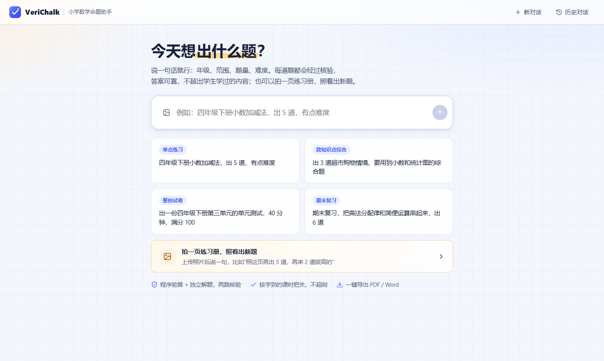
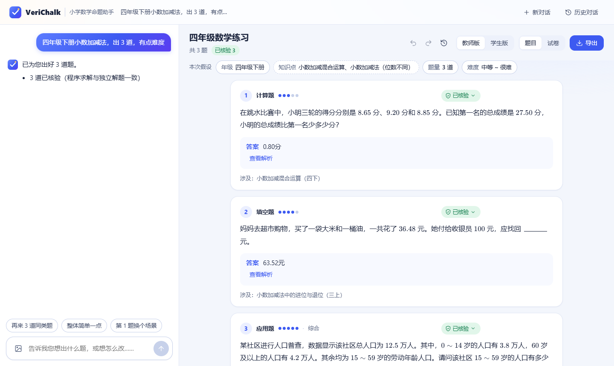
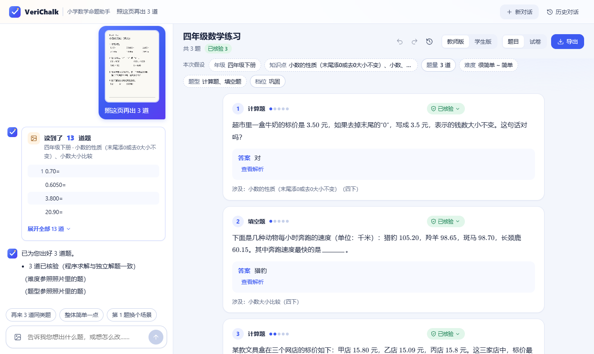
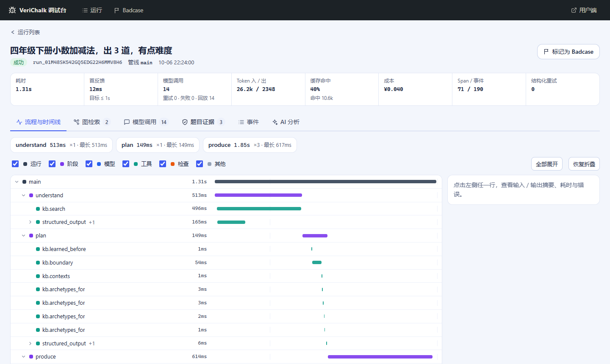

# VeriChalk

**面向小学数学教师的可验证命题 Agent。** 用一句话或一张练习册照片说清需求，几十秒内得到答案经核验、不超纲、有新意的题目或整份试卷；在线微调，一键导出 PDF / Word / Markdown / LaTeX。

课程知识（北师大版 1～6 年级：知识图谱、题型、能力边界、情境）来自 [ChalkBase](https://github.com/Scorpioyyy/chalkbase)。



> **状态：可小范围试用，尚未达到公开发布的全部门槛。** 理解 / 生成 / 编辑 / 整卷 / 拍照 / 导出、用户端与调试台均已完成并通过端到端测试；出题的答案正确率与超纲率两项闸门还没过（A2(a) 0.944 对 0.99，A3 0.048 对 0.02），详见下面的"评测结果"。路线图见 [docs/roadmap.md](docs/roadmap.md)。

## 它能做什么

| | |
|---|---|
| **一句话出题** | "四年级下册小数加减法，出 5 道，有点难度"——逐题上屏，每道题带核验徽标；需求含糊时只问一个问题。 |
| **拍照出题** | 上传练习册 / 作业 / 试卷照片（1～4 张）+ "照这页再出 5 道，再来 2 道拔高的"：照片只用来了解学生学过和做过什么，新题不照抄；照片太模糊时先请教师核对。 |
| **整份试卷** | 先确认细目表（分区、题型、题量、分值），再看样题，最后成卷，分值合计精确等于满分。 |
| **在线微调** | 就地编辑，或用一句话改（"第 3 题换个场景""整体简单一点"）；撤销 / 恢复 / 版本历史 / 对比；手改后自动复核。 |
| **导出** | PDF（Typst）、Word（原生公式）、Markdown、LaTeX；学生版 / 教师版。 |
| **调试台**（`/debug`） | 每次运行一棵 span 树：流程与时间线、按学期分层的图检索、模型调用检查器、题目证据、Badcase 入库；还可以和"AI 分析"围绕某一次运行对话，不必逐条翻记录。 |







## 设计要点

- **知识库是上下文，不是模板。** 教材题告诉 Agent"学生学过什么"，新题由知识图谱串联多个知识点、在新情境里生成，而不是改教材原题。用户明确要求优先。
- **答案可核验，且诚实标注。** 求解程序与独立盲解两路一致才标"已核验"；超纲由课时级能力边界校验；对不上的题宁可丢弃，也不放行。
- **确定性优先。** 能用规则或算法完成的不交给模型；模型只用在需要语义理解 / 生成的地方，每次调用都在 trace 里可查。
- **一切可观测。** 每次运行是一棵 span 树；用户的进度条、开发者的调试台、指标与评测读的是同一份事件日志。
- **评测先行。** 指标分北极星 / 闸门 / 目标 / 护栏 / 诊断五层（[docs/metrics.md](docs/metrics.md)），badcase 闭环到回归集；模型调用可录制回放，回归测试无网络、无密钥、零成本。

## 评测结果（test 划分，2026-10-06）

对照朴素直出（同一个模型一次生成、无核验）；完整报告见 [eval/reports/release_m8.md](eval/reports/release_m8.md) 与 [eval/specs/e2e.md §5](eval/specs/e2e.md)。

| 指标（36 个出题用例，要求 187 题） | VeriChalk | 朴素直出 |
|---|---|---|
| A1 题目可直接使用 | **0.855** | 0.642 |
| A2(b) 答案正确 | **0.945** | 0.759 |
| A3 超纲 | **0.048** | 0.155 |
| A5(b) 套内重复 | **0.110** | 0.203 |
| 题量达成率（交付 / 要求） | 0.775 | 1.000 |
| 端到端时长 p50 | 169s | 11s |
| 单题成本 | ¥0.019 | ¥0.001 |

核验换来的是正确率、不超纲和不重复；代价是更慢、更贵，且有 42 道题因反复核验不过被丢弃。**未过闸门的两项**：已核验题答案正确率 0.944（要求 ≥ 0.99）、超纲率 0.048（要求 ≤ 0.02），属于下一轮质量优化。其余闸门（运行成功率、trace 完整、导出、重启恢复、提示注入）均已通过。

## 本地运行

需要环境变量 `DASHSCOPE_API_KEY` / `DASHSCOPE_BASE_URL`（国内）或 `DASHSCOPE_INTL_API_KEY` / `DASHSCOPE_INTL_BASE_URL`（新加坡），以及 `VERICHALK_PROFILE=cn|intl`。Python ≥ 3.11、Node ≥ 20。

```bash
pip install -e "backend[dev]"        # 后端（依赖 chalkbase）
cd frontend && npm install && npm run build && cd ..
python scripts/dev.py run            # http://localhost:8000：用户端 /，调试台 /debug（本机未配置令牌时直接可进）
```

前端开发：`cd frontend && npm run dev`（Vite，`/api` 代理到 8000）。完整命令见 [CLAUDE.md §8](CLAUDE.md)。

## 部署

单容器、同源托管，步骤与环境变量见 [deploy/README.md](deploy/README.md)（Zeabur 推荐步骤、持久卷、调试台令牌、上线前必读）。**没有访问控制与配额**，建议先只把链接发给小范围的人。

## 文档

| 文档 | 内容 |
|---|---|
| [docs/brief.md](docs/brief.md) | 项目委托书：目标、约束与工作方式要求（需求来源） |
| [docs/prd.md](docs/prd.md) | 产品需求：用户、场景、原则、功能与验收 |
| [docs/metrics.md](docs/metrics.md) | 指标体系 |
| [docs/architecture.md](docs/architecture.md) | 分层架构、数据模型、事件协议、阶段、调试台 |
| [docs/design.md](docs/design.md) | 设计决策记录（D1…） |
| [docs/evaluation.md](docs/evaluation.md) | 评测方案、数据集、判官、badcase 闭环 |
| [docs/roadmap.md](docs/roadmap.md) | 里程碑与出口标准 |
| [eval/specs/](eval/specs/) | 各阶段评测规格与结果 |
| [CLAUDE.md](CLAUDE.md) | 工程规则 |

## 许可

[MIT](LICENSE)
