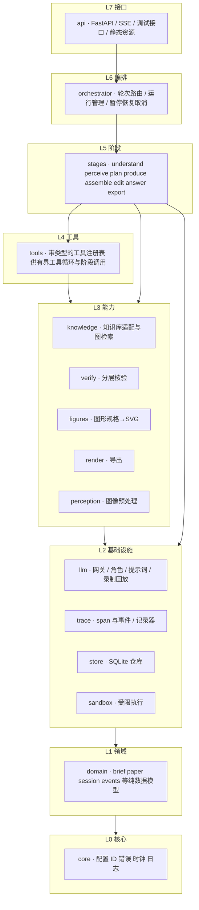
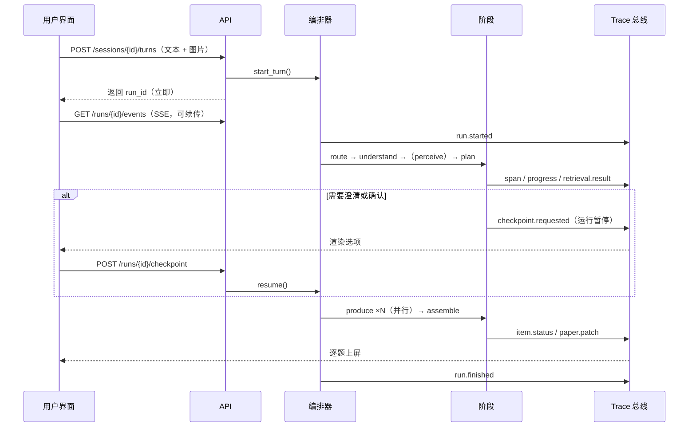
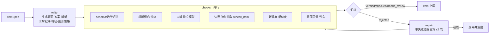

# 架构

> 本文定义模块划分、依赖方向、数据模型、事件协议与关键流程。目标：**先把骨架与契约定清楚，之后的迭代只在固定的扩展点上进行**，避免打补丁式演进。决策的取舍理由见 [design.md](design.md)（以 `D<n>` 引用）。

## 1. 目标与约束

| 目标 | 体现 |
|---|---|
| 评测先行、可观测 | 所有行为落为事件日志；指标、调试台、进度条都读同一份事件（D6） |
| 可替换 | 模型、检索、导出引擎、存储都在窄接口之后；换模型只改配置（D10） |
| 可复现 | 提示词有版本，模型调用可录制回放，运行可从任一阶段重放 |
| 创新而可信 | 知识库作上下文而非模板；生成后经分层核验（D5、D9） |
| 好交付 | 题目内容格式统一，预览与多格式导出同源（D7、D8） |
| 好部署 | 单仓库、单容器；前后端同源；本地 `localhost` 与云端一致（D2） |

约束：Python ≥ 3.11、Node ≥ 20；知识库通过 `pip install chalkbase` 引入（同步 API，用线程池包装）；模型走 DashScope OpenAI 兼容接口（国内 / 新加坡两个 profile）。

## 2. 分层与依赖规则



**规则**（由 `tests/test_architecture.py` 用 AST 扫描强制，违反即失败）：

1. 只允许依赖**同层或更低层**；`domain` 与 `core` 不做 I/O。
2. `api` 只通过 `orchestrator` 触达业务；`stages` 不得导入 `api`、`orchestrator`。
3. 业务代码不直接调用 `httpx` / `requests` / `chalkbase` / `subprocess`：模型走 `llm`、知识库走 `knowledge`、执行代码走 `sandbox`。
4. 任何阶段、工具、模型调用都必须在 trace span 内执行（`trace.span(...)` 上下文管理器是唯一入口）。

## 3. 一次对话轮次的数据流



**运行（Run）状态机**：`created → running ⇄ awaiting_user → succeeded | failed | cancelled`。每个阶段的输出持久化在运行状态中，因此可**暂停恢复**、**从某阶段重放**（调试）、**断线续传**。

## 4. 领域模型（`domain/`）

纯 Pydantic 模型，是前后端契约的来源（OpenAPI → TypeScript 类型自动生成，D13）。

### 4.1 Brief（结构化需求）

```
Brief
  action        generate | paper | review          本次要做什么
  scope         年级 / 学期 / 单元 / 课时 / 知识点 / 自由文本主题   （每个字段 Field[T]）
  count         题量
  difficulty    单值 1–5 或分布
  kinds         选择 / 填空 / 计算 / 判断 / 应用 / 开放
  tier_mix      巩固 : 变式 : 综合
  source        auto | novel | template
  style         情境偏好、语气、限制（"数字别太大""不要图形题"）
  references    [ReferenceItem]       来自照片或用户粘贴的题（上下文 + 防雷同集合）
  paper         时长 / 总分 / 大题结构（仅 paper 任务）
  assumptions   [str]                 展示给用户的"本次假设"
Field[T] = { value, origin: user | inferred | default, confidence }
```

### 4.2 会话、轮次、运行

`Session`（匿名，含 `Paper` 与消息列表）→ `Turn`（一条用户输入）→ `Run`（一次 Agent 执行，状态机见上）。`Run` 持有各阶段输出快照与事件序列。

### 4.3 试卷与题目（IR）

```
Paper   id, title, rev, sections[Section], meta(学校/班级/日期/总分/时长)
Section title, kind, items[Item]
Item    id, kind, stem, options?, answer, answer_value?, solution
        kp_ids, difficulty, tier, score, figures[FigureSpec]
        provenance { source: novel|template|edited, archetype_ids, reference_ids, run_id, model }
        verification { status: verified|checked|needs_review|rejected, checks[CheckResult] }
        rev
Revision  paper_id, rev, patch[Op], snapshot, author: agent|user, run_id?, ts
```

**内容格式（D7）**：`stem` / `options` / `solution` 等文本字段统一为 **Pandoc Markdown + TeX 数学**（`$…$`、`$$…$$`），填空横线写作 `____`，插图以 `` 引用 `figures` 中的结构化 `FigureSpec`。一种格式同时服务于模型输出、人工编辑、前端预览（KaTeX）和所有导出，避免多套 AST 互转。数学语法在入库前用 LaTeX 解析器校验，并经**内容规范化**（修剪 `$` 内侧空格、填空位置移出公式，D27）。导出时单个题干由 pandoc 转成目标格式的片段，**整体版面由自有 Typst 模板负责**（D8）。

**修改一律是 Patch（D22）**：`add_item / remove_item / replace_field / move_item / set_meta`。手动编辑、自然语言编辑、Agent 生成都产出 Patch，应用后得到新 `rev` 并存快照，统一支持撤销 / 重做 / diff。

### 4.4 核验结果

`CheckResult { name, status: pass|warn|fail|skip, detail, evidence }`。状态汇总规则（D9）：

| 状态 | 条件 |
|---|---|
| `verified` | 结构检查通过 ∧ 求解程序与盲解**两路一致**且与所给答案一致 ∧ 边界 `in`（或 `borderline` 已提示）∧ 无歧义告警 |
| `checked` | 结构通过 ∧ 仅一路求解一致 ∧ 边界通过 |
| `needs_review` | 存在 `warn`（如盲解分歧、边界 `borderline`、歧义疑点）——展示并标注原因 |
| `rejected` | 任一 `fail`——进入修复；修复上限后废弃重出，不展示 |

## 5. 阶段（`stages/`）

每个阶段是一个**带类型输入输出的异步函数**，由 `StageRunner` 包裹（自动开 span、记录耗时、捕获异常为带类型的错误、可跳过已有输出以支持重放）。阶段之间只通过领域模型交换数据。

| 阶段 | 输入 → 输出 | 模型角色 | 工具 / 能力 | 核心指标 |
|---|---|---|---|---|
| `understand` | 轮次 + 会话上下文 → `Understanding`（路由、Brief、澄清、芯片）。**路由并入理解，一次模型调用**，其余由确定性后处理完成（D29） | fast | `knowledge.search`（与模型调用并行）、规则解析（基线 / 降级） | B1 B2 B3 |
| `perceive` | 图片 → ReferenceSet（逐页判定、逐题转写、知识点、难度、学生上下文、是否需教师核对）。多张并行；一张失败不拖垮整个阶段（D51） | vision | `perception` 预处理与画质检测、`knowledge.search`（页面标题与各题知识主题，并行） | B4 B5 B6 P5～P9 |
| `plan` | Brief + 上下文 → Blueprint（ItemSpec 列表） | smart | 组合挖掘（确定性）+ 有界工具循环（兜底） | A4 A5c |
| `produce` | ItemSpec → Item | 见 §5.1 | 沙箱、边界、相似度 | A1–A3 A6 E4 |
| `assemble` | Items + Brief → Paper 修订 | — / fast | 排序与分值规则 | A4 |
| `edit` | Paper + 指令 → Patch → 复核 | smart | `produce` 的核验子流程 | C1 |
| `answer` | Paper + 问题 → 文本 | fast | — | — |
| `export` | Paper + 选项 → 文件 | — | `render` | C4 |
| `reply` | 全部结果 → 助手消息（总结、假设、下一步建议） | fast | — | — |

### 5.1 `produce`：单题子管线（逐题并行，受并发上限约束）



- `write` 的上下文：该题目标知识点的教材题型（作为"学生做过什么"的示范，明确禁止抄写）、情境、边界约束（数域、小数位数、概念范围）、已出题目摘要（防重）、用户上传题（防重）。
- 并行检查中，成本高的盲解可按预算降级（F3，UI 告知）。
- `template` 来源走快速路径：`chalkbase.instantiate` 得到题与程序答案，跳过 `write`，仍做边界与 schema 检查。

### 5.2 `plan`：图检索是"创新"的核心（D20）

目标：给出每道题要用哪些知识点、在什么情境里交织、什么难度、数值范围多大。

1. **确定性候选**：`knowledge.anchor()`（需求 → 锚点知识点集，来自 `search` + 用户指定）；`ComboMiner` 在"已学范围"（`learned_before(lesson)`）内、以锚点为中心，沿 `prerequisite / builds_on / extends / related` 边及教材题型的 `secondary_knowledge_point_ids`（真实的跨点共现）挖掘 2～3 个知识点的组合，按边类型权重、图距离、共现强度、领域搭配打分，输出带理由的候选组合。
2. **LLM 选择与生成**：在候选中选择并为每题给出情境与问法设想（情境库 `contexts_for` 提供年级适配的情境与数值范围）。
3. **有界工具循环（兜底）**：候选不足或需求开放时，LLM 可在预算内（≤6 步）调用图检索工具探索（`kp_chain / kp_relations / review_candidates / archetypes_for / exercises_sample`）。
4. 输出 `Blueprint`：`ItemSpec { kp_ids, tier, difficulty, kind, scene, number_constraints, rationale }`，并附 `retrieval.result` 事件供调试台绘制检索图。

> 为什么确定性优先：可复现、延迟低、可单独评测（A5c 真综合率直接受益），LLM 只做"选择与生成"这种真正需要语义的事。

## 6. 事件与 Trace（D6）

**Span 是一切的原子**：运行、阶段、模型调用、工具调用、核验检查都是 span（带父子关系）；额外有点事件（进度、消息增量、检查点、补丁）。

```
Event 信封  { seq, run_id, span_id, parent_id, ts, type, visibility: user|debug, data }
```

| type | 说明 | 面向 |
|---|---|---|
| `run.started / finished / failed / cancelled / paused` | 运行生命周期 | user + debug |
| `span.started / finished` | `kind`: stage / llm / tool / check；属性含输入摘要、输出摘要、错误、重试 | debug |
| `llm.call`（挂在 llm span 上） | 模型、角色、参数、`prompt_hash`、messages（可展开）、输出、`usage{prompt, completion, cached}`、TTFT、总时长、成本、重试次数 | debug |
| `progress` | `{label（教师语言）, current, total}` | user |
| `message.delta` | 助手文本增量 | user |
| `retrieval.result` | 图检索命中的节点、边、分数、选中的组合 | debug |
| `item.status` | 某题核验状态变化（含 checks 摘要） | user + debug |
| `item.delivered` | 一道题通过核验、可以给教师看了（带完整 `Item`）。整份试卷要等全部完成才装配成修订，用户端靠它逐题上屏（schema 1.2，D48） | user + debug |
| `paper.patch` | 试卷新修订（补丁 + rev） | user |
| `understanding.ready` | 需求理解完成：路由、Brief、"本次假设"芯片（schema 1.1 新增） | user |
| `perception.ready` | 照片识别完成：逐页判定与逐题转写、知识点、置信度、学生上下文；教师在核对检查点修改后再发一次（schema 1.3，D51） | user |
| `checkpoint.requested` | 澄清 / 蓝图确认 / 样题确认 / 识别结果核对（`perception`） | user |
| `usage.update` | 累计 token 与成本 | debug |

- **存储**：SQLite（WAL）`events` 表（run_id, seq 主键）+ `runs / sessions / papers / revisions / attachments / badcases`；通过仓库接口隔离，后续可换 Postgres（D12）。
- **传输**：SSE；`id: <seq>`，客户端断线用 `Last-Event-ID` 续传（D11）。
- **契约**：事件类型是带判别字段的 Pydantic 联合类型，随 OpenAPI 导出，前端据此生成类型；事件 schema 带 `schema_version`，只增不改。
- **前端状态** = 事件的纯函数（reducer），因此"回放一次运行"与"实时查看一次运行"是同一套代码（D23）。

## 7. LLM 网关（`llm/`，D10）

- **角色别名**：`fast` / `smart` / `vision` / `judge` / `solver` / `embed` 映射到具体模型（`config/models.yaml`），业务代码只写角色。换模型或做对比评测只改配置。
- **Profile**：`cn`（`DASHSCOPE_API_KEY` + `DASHSCOPE_BASE_URL`）与 `intl`（`DASHSCOPE_INTL_API_KEY` + `DASHSCOPE_INTL_BASE_URL`），由 `VERICHALK_PROFILE` 选择；密钥只来自环境变量。
- **流式为默认**：所有调用用流式并聚合，以测得 TTFT；用户可见的文本直接转发为 `message.delta`。
- **结构化输出**：JSON 模式 + Pydantic 校验；校验失败带错误信息重试（≤2），失败率计入 E5。
- **缓存友好的提示词布局（E2）**：`PromptBuilder` 把提示固定为 `[静态系统提示 | 会话级稳定上下文 | 本次动态内容]` 三段，只允许在尾部追加；构建时记录每段 token 与"理论可命中前缀"，调用后与 `cached_tokens` 对比，得到前缀稳定度。工具定义、知识库指南、Schema 说明都放在静态段。
- **提示词即资产**：`prompts/<阶段>/<名称>.md`，带 `id / version / role` 前置元数据；调用 span 记录 `prompt_id@version` 与哈希，评测报告按提示词版本分层。
- **录制回放**：`mode = live | record | replay | replay_or_live | replay_or_record`（后者：有录制就回放，没有才调用并录下，用于重录一组互相依赖的录制）；键 = hash(model, 参数, messages)。单元 / 集成测试与回归评测用 `replay`，确定且零成本。
- **预热**：服务启动与页面打开时，对每个已发布提示词的静态前缀发 `max_tokens=1` 的请求（`orchestrator/warmup.py`）。收益经消融实验验证（D28）。
- **治理**：并发信号量、429 退避、超时、单运行预算（token / 成本上限，超限触发降级）、价格表（`config/pricing.yaml`，输入未命中 / 命中 / 输出分开）。

## 8. 知识层（`knowledge/`）

`chalkbase.Curriculum` 的**薄适配**：①线程池包装为异步；②所有返回换成面向 LLM 的紧凑结构（只含必要字段与教师可读名称）；③每次调用产出 span 与（检索类）`retrieval.result`；④把 `DASHSCOPE_*` 的环境映射到 chalkbase 所需变量（因其向量检索读 `DASHSCOPE_API_KEY`）；⑤进程内单例，启动时预热（约 1 秒，内存占用在 M1 实测并记入部署文档）。

对 `stages` 暴露的服务接口：`anchor / combos / learned_scope / boundary / check_item / context_for / textbook_examples / instantiate`；对 LLM 工具循环暴露其中只读且安全的子集。

## 9. 调试台（FR-11）

面向开发者，目标是"一个 query 进来，每一步的去向一目了然"，并服务 badcase 分析。数据全部来自事件日志与评测报告。

| 视图 | 内容 |
|---|---|
| 运行列表 | 筛选（状态、模型、任务类型、时间、标签、是否 badcase）、延迟 / 成本 / 缓存命中的迷你图 |
| 流程视图 | 阶段 DAG：节点显示状态与耗时，并行的逐题子流程展开；点击聚焦 |
| 时间线 | span 瀑布图，高亮关键路径与等待；可按模型 / 阶段着色 |
| **图检索视图** | 复用 ChalkBase 可视化的技术栈（d3 + dagre）：按学期分层的知识图，命中节点按得分着色、被选中的组合高亮、边按类型区分，随步骤动画回放"检索过程"；点击节点看知识点、边界与教材题型 |
| 步骤检查器 | 任一 span 的提示（分段显示静态 / 稳定 / 动态，并标出缓存命中的前缀）、输出、参数、usage、TTFT、重试 |
| 题目证据 | 每道题的核验各项证据：求解程序与输出、盲解过程、边界特征与违规、相似度近邻 |
| 对比与重放 | 同一输入两次运行的差异；从指定阶段、替换模型 / 提示词版本重放 |
| Badcase | 一键标记并选择根因类别，写入 `eval/badcases/` |
| 指标页 / 评测页 | 按 [metrics.md](metrics.md) 分层展示；评测运行的失败样本按原因归类 |

访问控制：生产环境需 `VERICHALK_DEBUG_TOKEN`；调试数据含用户内容，默认不对公网开放。

## 10. 扩展点（新增东西的固定做法）

| 要新增 | 做法 | 必须同步的 |
|---|---|---|
| 阶段 | 在 `stages/` 写带类型 IO 的函数，在 `orchestrator/pipelines.py` 注册 | 评测规格、指标、提示词、trace 标签 |
| 工具 | 在 `tools/` 用装饰器注册（名称、参数模型、结果模型、是否只读） | 单元测试、调试台渲染（可选） |
| 核验检查 | 在 `verify/checks/` 实现 `Check` 协议并注册进汇总规则 | 状态汇总规则、A2/A3 评测 |
| 图形类型 | `figures/` 增加 `FigureSpec` 变体与渲染器 | 评测用例、导出保真检查 |
| 导出格式 | `render/` 实现 `Exporter` | C4 检查、导出选项 |
| 模型 / 提供方 | `config/models.yaml`、`pricing.yaml` | 角色级对比评测 |
| 指标 | `metrics/` 中加纯函数 + [metrics.md](metrics.md) 登记 | 测试、报告 |
| 事件类型 | `domain/events.py` 加联合成员并升 schema 次版本 | 前端 reducer、调试台 |

## 11. API 概览

| 方法 | 路径 | 说明 |
|---|---|---|
| POST | `/api/warmup` | 页面打开时调用：后台预热模型连接与前缀缓存（特性开关 `warmup`，有效期内重复调用不发请求；D28） |
| POST | `/api/sessions` | 新建匿名会话 |
| PATCH / DELETE | `/api/sessions/{id}` | 改名（标题 1～60 字）/ 删除（级联清理；有进行中的运行时 409；D56） |
| GET | `/api/sessions/{id}` | 会话状态（消息、当前试卷、进行中的运行） |
| POST | `/api/sessions/{id}/turns` | 提交一轮输入（multipart：文本 + 图片），返回 `run_id` |
| GET | `/api/runs/{id}/events` | SSE，支持 `Last-Event-ID` |
| POST | `/api/runs/{id}/checkpoint` | 回应澄清 / 确认 |
| POST | `/api/runs/{id}/cancel` | 取消 |
| PATCH | `/api/sessions/{id}/paper` | 手动编辑（Patch），返回新修订与复核运行 |
| POST | `/api/sessions/{id}/paper/undo`、`redo`、`restore` | 撤销 / 重做 / 回到某一版（都是新增修订，D43） |
| GET | `/api/sessions/{id}/paper/history`、`/paper/diff?from=&to=`、`/paper/revisions/{rev}` | 修订历史（含能否撤销 / 重做）、两版之间的差异、某一版的试卷快照 |
| GET | `/api/sessions/{id}/attachments/{attachment_id}[?full=true]` | 本会话上传的图片（默认 720px 缩略图；聊天里显示照片用，只能取自己会话的附件） |
| GET | `/api/sessions/{id}/figures/{figure_id}` | 试卷里某个图形的 SVG（预览与导出共用同一份渲染） |
| GET | `/api/knowledge/refs?ids=` | 知识点的教师可读名称与位置（题目旁显示"涉及：…"，永不显示 ID） |
| POST | `/api/sessions/{id}/export` | 导出（格式与选项），返回文件 |
| GET | `/api/health`、`/api/version` | 健康检查与版本（含 chalkbase 版本与数据版本） |
| GET | `/api/debug/runs`、`/runs/{id}`、`/runs/{id}/events`、`/runs/{id}/stream`（SSE，含 debug 事件）、`/metrics`、`/kp/{id}` | 运行列表（带教师原话与指标）、运行详情、全部事件、实时事件流、聚合指标、知识点详情（需令牌） |
| POST | `/api/debug/runs/{id}/chat` | 运行分析助手：请求体是对话历史，响应是 SSE（`delta` / `tool` / `done` / `error`；需令牌；D56） |
| GET/POST | `/api/debug/badcases` | Badcase 列表 / 入库（YAML 文件，根因类别必填） |

## 12. 前端结构

单个 Vite + React + TypeScript 应用，两个入口路由：`/`（用户端）、`/debug`（调试台）；共享 `shared/`（API 客户端、事件 reducer、公式渲染、设计系统）。由 FastAPI 同源托管构建产物，本地开发用 Vite 代理。用户端的状态由事件流 reducer 驱动。

```
frontend/src/
  shared/    api（schema.gen.ts 由 OpenAPI 生成 · types.ts · client.ts · sse.ts）  events（reducer）
             math（parse · Rich/KaTeX）  ui（base.css 令牌 · components.css · Icon · StatusBadge）  labels.ts（教师语言）
  user/      controller.ts（会话控制器，不依赖 React）  chat/（消息、进度、检查点、输入框）
             paper/（工作台：题目卡片、就地编辑器、假设芯片、试卷视图 pdf.js、导出对话框、版本历史与 diff）  Welcome
  debug/     model.ts（事件 → span 树 / 调用 / 检索 / 题目证据）  RunList  RunDetail  Timeline  GraphView  Calls
             ItemsEvidence  EventsLog  BadcaseDialog  Badcases
frontend/e2e/  Playwright 端到端（真实后端 + 模型回放）
```

决策见 [D47～D50](design.md)；评测见 [eval/specs/frontend.md](../eval/specs/frontend.md)。

## 13. 配置、部署与目录

- **配置**：`pydantic-settings`；环境变量 > `.env`（不入库）> 默认。关键变量：`VERICHALK_PROFILE`（`cn|intl`）、`VERICHALK_DATA_DIR`、`VERICHALK_DEBUG_TOKEN`、`VERICHALK_LLM_MODE`、`PORT`。
- **部署**：根目录一个多阶段 `Dockerfile`（构建前端 → 安装后端与 chalkbase → 同镜像托管静态资源与 API），数据目录挂载卷；`/api/health` 作健康检查。本期只保证本地 `localhost` 跑通，云端部署（Zeabur）在 M8 完成，目录与配置已按此约定。
- **目录**：见仓库根 [CLAUDE.md](../CLAUDE.md) §7。

## 14. 测试策略

| 层 | 内容 | 运行 |
|---|---|---|
| 不变量 / 架构 | 分层依赖、事件 schema 快照、OpenAPI 与前端类型一致、提示词元数据完整 | 每次提交 |
| 单元 | 纯函数：ComboMiner、Patch 应用、核验汇总、指标计算、沙箱 | 每次提交 |
| 集成（replay） | 用录制的模型响应跑完整阶段 / 管线，断言事件序列与领域输出 | 每次提交 |
| 组件评测 | 各阶段对标注数据（B1、B4、A3 …） | 阶段验收 / 每日 |
| 端到端评测 | 场景用例集上的 A–F 全指标 | 里程碑验收 |
| 前端 | 类型检查、组件测试、Playwright 冒烟与截图 | 前端里程碑 |
